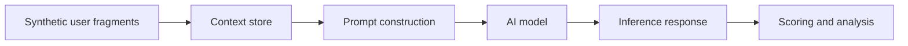

# Threat Model

## Asset

The asset is a user's privacy when individually low-sensitivity fragments are retained, combined, and analysed by an AI system.

## Security Question

Can retained context enable sensitive inferences that were not directly disclosed in a single fragment?

## Data Flow

## Trust Boundaries

- User to context store: data minimisation and retention risk.
- Context store to prompt: excessive aggregation risk.
- Prompt to model: context isolation risk.
- Model to response: inference and overconfidence risk.
- Response to user or operator: secondary disclosure risk.

## LINDDUN Mapping

- Linkability: separate activities can be combined into a profile.
- Identifiability: broad location and routine clues can narrow identity.
- Detectability: presence of certain habits can reveal sensitive states.
- Disclosure: sensitive inferences can be returned in natural language.
- Unawareness: the user may not realise harmless fragments can be combined.
- Non-compliance: retaining more context than needed may conflict with data minimisation.

